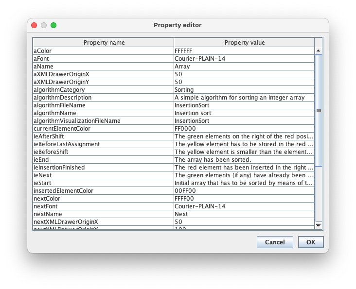
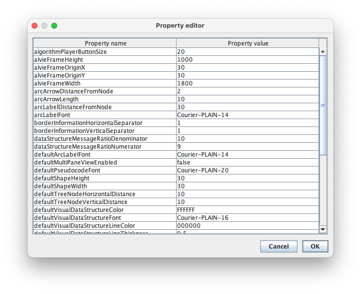

# AlViE
This is the Java code of the Algorithm Visualization Environment (in short, AlViE) which has been used in the following papers.

- P. Crescenzi, C. Nocentini. Fully integrating algorithm visualization into a CS2 course: a two-year experience. Proc. ITiCSE, 296-300, 2007.
- P. Crescenzi. Using AVs to explain NP-completeness. Proc. ITiCSE, 299, 2010.
- P. Crescenzi, E, Enström, V. Kann. From theory to practice: NP-completeness for every CS student. Proc. ITiCSE, 16-21, 2013.

This code is not maintained anymore, but it should still work as expected (by using the Java libraries included in the lib folder) when run with JDK 16.

## Executing AlViE
Once imported the repository (either, for example, in Eclipse or in VS Code), executing the class `org.algoritmica.alvie.desktop.Main` will start AlViE (note that the first time AlViE is run, the file `.alvie4settings` is created inside the user's home folder). Once AlViE has been started, an empty window appears as shown in the following figure.


The toolbar contains 18 buttons, but 13 of them are only activated after that a visualization has been loaded. The first button
of the toolbar (that is, the information button) allows the user to open a window containing some information related to AlViE, such as
the one shown in the following figure.


## Showing the visualization of an algorithm
To show the visualization of an algorithm, you need to select the fourth button from the left (that is, the button whose icon is a television) in the toolbar. In doing so, the user is asked to select the algorithm to display, as shown in the following figure.


Once the algorithm has been selected, its visualization can be loaded by clicking on the `OK` button. A list of files is therefore shown to the user, who is asked to select the one to load (the first time AlViE is used this list contains only one file: however, new visualizations can be generated by the user). We observe that the file selection dialog opens starting from the folder `visualization` contained in the folder corresponding to the selected algorithm and included in the folder `algorithms`: obviously, the user can navigate within the file system and select a file contained in a different folder. We also observe that, when searching for the visualization file to be displayed, AlViE applies a filter that selects only the files whose extension is `.xml`: the memorization of the data structures and the execution steps of the algorithms, in fact, makes use of the XML language. For example, if the user has selected the algorithm `LCS (Jones-Pevzner)`, then the following selection dialog is shown.


Once the file to be displayed has been selected and once the `Open` button has been clicked, AlViE reads the entire file and displays the first step of the algorithm (note that, if the XML file is very large, the reading can take several seconds and only at the end of it is the display of the first step of the algorithm shown). For example, having selected the `LCS.xml` file, the first step of the dynamic programming algorithm to solve the longest common sub-sequence problem is displayed, as shown in the following figure.


As a visualization is now loaded, other toolbar buttons are now activated. AlViE provides four buttons for navigating within the running visualization of an algorithm, the first of which returns to the first step display of the execution of the algorithm. The next button allows you to go back one step while the next one allows you to advance one step. The last navigation button allows you to skip to the last step of the algorithm.

## Specifying the input of an algorithm

AlViE allows (if whoever developed the algorithm did it in appropriate way) the execution of an algorithm with input values selected by the user and, therefore, the visualization of the execution of the algorithm with such input values. AlViE allows you to specify the input values of an algorithm using data structures, the simplest one being an array: for this reason, let us first see how AlViE requires an array being described.

### XML specification of a data structure
The specification of a data structure is stored into an XML file whose first line must be as follows.

```
<?xml version="1.0" encoding="UTF-8"?>
```

The XML code must then continue with the structure tag, which is provided with two attributes: name (which specifies the name of the data structure) and type (which specifies the type of the data structure). For example, the XML file of an array could start with the following structure tag

```
<structure name="Values" type="Array">
```

and end with the following final tag
```
</structure>
```

In this case, the name of the data structure is `Values` and the type is `Array`. Inside the structure tag the file contains the XML specification of the data structure. This specification depends on the data structure: we describe in detail in the next paragraph the
XML specification used by AlViE in the case of arrays.

#### XML specification of an array

The XML specification of an array begins with the array tag to which two attributes are associated: the number of elements contained in the array (size attribute) and the type of information that each element stores (type attribute). Next, the XML specification of an array contains as many element tags as are the elements of the array itself: each of these tags has two attributes that specify the location of the element within the array (id attribute) and the value it contains (value attribute). For example, the array containing the eight integers 5, 3, 6, 2, 7, 1, 8, and 4 has the following XML specification.

```
<structure name="Values" type="Array">
  <array size="8" type="IntInformation">
    <element id="0" value="5" />
    <element id="1" value="3" />
    <element id="2" value="6" />
    <element id="3" value="2" />
    <element id="4" value="7" />
    <element id="5" value="1" />
    <element id="6" value="8" />
    <element id="7" value="4" />
  </array>
</structure>
```

The type of information contained in each element of the array, which is specified by the type attribute of the array tag, must be one of those allowed by AlViE, that is, `BooleanInformation` (to represent the values true and false), `CharInformation` (to represent single characters), `DoubleInformation` (to represent real numbers), `IntInformation` (to represent 32-bit integers), `LongInformation` (to represent 64-bit integers), and `StringInformation` (to represent sequences of characters). Clearly, that type of information must be compatible with the type of the input data of the algorithm we want to run: in other words, we can't run an algorithm that expects in
input an array of integers, giving as input an array of boolean values.

## Executing and visualizing an algorithm

Suppose we want to run the insertion sort algorithm on the sequence 8, 7, 6, 5, 4, 3, 2, 1. The implementation of the insertion sort algorithm expects that this sequence is specified within an array: as we have seen previously, this specification is the following.

```
<structure name="Values" type="Array">
  <array size="8" type="IntInformation">
    <element id="0" value="8" />
    <element id="1" value="7" />
    <element id="2" value="6" />
    <element id="3" value="5" />
    <element id="4" value="4" />
    <element id="5" value="3" />
    <element id="6" value="2" />
    <element id="7" value="1" />
  </array>
</structure>
```

Once the XML specification has been saved, for example, in the file `InsertionSortNewInput.xml` file included in the `input` folder contained in the `insertionSort` folder inside the `algorithms` folder, we can execute the insertion sort algorithm with input the new array, by selecting the third button within the toolbar (that is, the button whose icon is a clapperboard). By doing so, the user can select the algorithm to execute: in our case, the algorithm is called `Insertion sort`. Once the algorithm has been selected, the user is asked to specify the name of the file in which to save the visualization of its execution. Having done this, the execution itself begins by asking the user to choose the array to sort (in our case, the `InsertionSortNewInput.xml` file). By selecting this file, the algorithm is executed and a message warns the user when the algorithm has terminated (we note that until this message does not appear, it means that the algorithm is still running). At the end of the execution the visualization file is loaded and its first step is shown to the user.

## Configuring a visualization

Although it is not possible to modify the general structure of the visualization without changing the source code, all views contained in the distribution of AlViE can be partially configured by appropriately modifying the property files associated with them. These files are located within the `config` folder contained in the corresponding folder to each algorithm and included within the folder
`algorithms`, and they all have the extension `.properties`. For example, the visualization properties file of the insertion sort algorithm is called `insertionSort.properties`: its content is the following.

```
aColor=FFFFFF
aFont=Courier-PLAIN-14
aName=Array
aXMLDrawerOriginX=50
aXMLDrawerOriginY=50
algorithmCategory=Sorting
algorithmDescription=A simple algorithm for sorting an integer array
algorithmFileName=InsertionSort
algorithmName=Insertion sort
algorithmVisualizationFileName=InsertionSort
currentElementColor=FF0000
ieAfterShift=The green elements on the right of the red position have already been compared with the yellow element, that has to be inserted within the elements on the left of the red positions (if any).
ieBeforeLastAssignment=The yellow element has to be stored in the red position.
ieBeforeShift=The yellow element is smaller than the element immediately on the left of the red position\: hence, this latter element has to be shifted to the right.
ieEnd=The array has been sorted.
ieInsertionFinished=The red element has been inserted in the right position.
ieNext=The green elements (if any) have already been examined. The red element has to be inserted within the preceding ones.
ieStart=Initial array that has to be sorted by means of the insertion sort algorithm.
insertedElementColor=00FF00
nextColor=FFFF00
nextFont=Courier-PLAIN-14
nextName=Next
nextXMLDrawerOriginX=50
nextXMLDrawerOriginY=100
pseudocodeEmphasizedLineColor=FFFFFF
pseudocodeEmphasizedLineHeight=15
pseudocodeEmphasizedLineWidth=450
pseudocodeFileName=InsertionSortPseudocode
pseudocodeFont=Courier-PLAIN-14
pseudocodeLineHeight=15
pseudocodeLineWidth=450
pseudocodeOriginX=50
pseudocodeOriginY=150
pseudocodeTitle=Pseudo-code
selectInputMessage=Select the array to be sorted
```

These properties can be changed by clicking on the fifth button of the toolbar of AlViE (that is, the button represented by a screwdriver). This will open the window property change shown in the following figure.



## Configuring AlViE

In addition to the specific properties of a visualization, AlViE can be partially configured by modifying the file of its global properties. For this purpose, the user must click on the second toolbar button (that is, the button represented by a wrench). In this way the property editing window as shown in the following figure.



The names of the global properties should be self-explanatory enough for the user to modify them appropriately.
