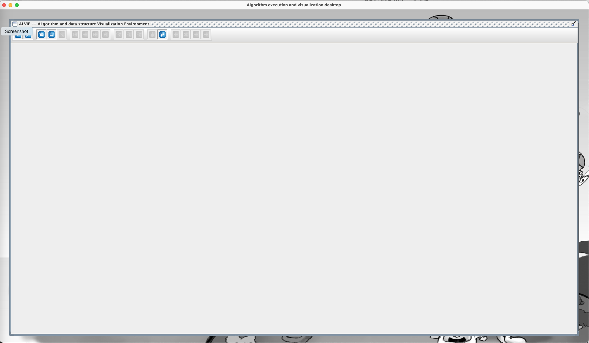
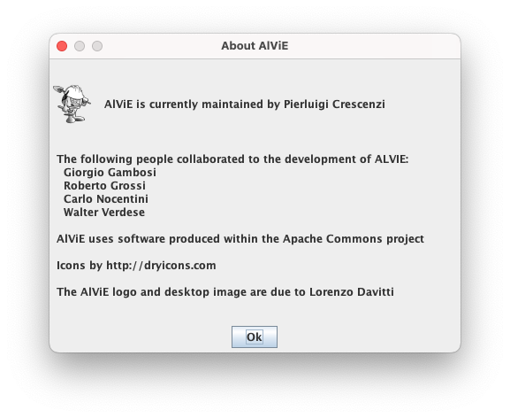
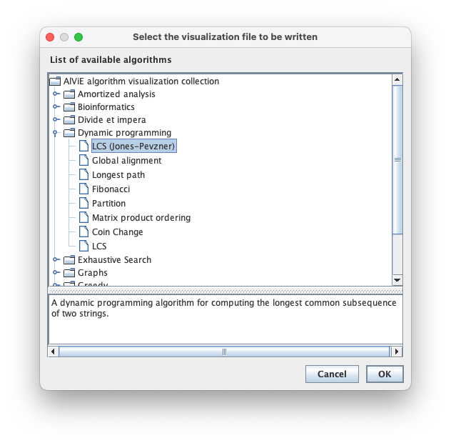
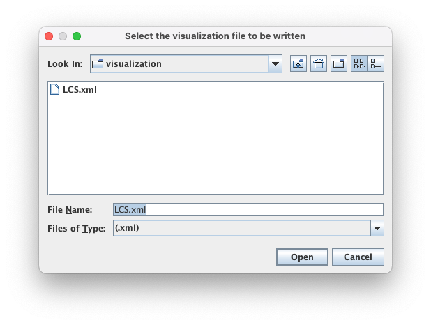
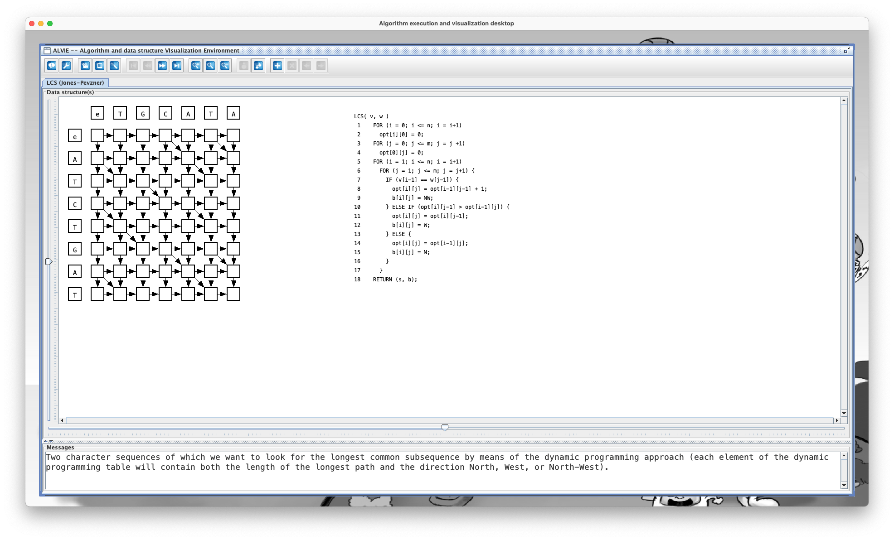

# AlViE
This is the Java code of the Algorithm Visualization Environment (in short, AlViE) which has been used in the the following papers.

- P. Crescenzi, C. Nocentini. Fully integrating algorithm visualization into a CS2 course: a two-year experience. Proc. ITiCSE, 296-300, 2007.
- P. Crescenzi. Using AVs to explain NP-completeness. Proc. ITiCSE, 299, 2010.
- P. Crescenzi, E, Enström, V. Kann. From theory to practice: NP-completeness for every CS student. Proc. ITiCSE, 16-21, 2013.

This code is not maintained anymore, but it should still work as expected (by using the Java libraries included in the lib folder) when run with JDK 16.

## Executing AlViE
Once imported the repository (either, for example, in Eclipse or in VS Code), executing the class `org.algoritmica.alvie.desktop.Main` will start AlViE (note that the first time AlViE is run, the file `.alvie4settings` is created inside the user's home folder). Once AlViE has been started, an empty window appears as shown in the following figure.

The toolbar contains 18 buttons, but 13 of them are only activated after that a visualization has been loaded. The first button
of the toolbar (that is, the information button) allows the user to open a window containing some information related to AlViE, such as
the one shown in the following figure.

To show the visualization of an algorithm, you need to select the fourth button from the left (that is, the button whose icon is a television) in the toolbar. In doing so, the user is asked to select the algorithm to display, as shown in the following figure.

Once the algorithm has been selected, its visualization can be loaded by clicking on the `OK` button. A list of files is therefore shown to the user, who is asked to select the one to load (the first time AlViE is used this list contains only one file: however, new visualizations can be generated by the user). We observe that the file selection dialog opens starting from the folder `visualization` contained in the folder corresponding to the selected algorithm and included in the folder `algorithms`: obviously, the user can navigate within the file system and select a file contained in a different folder. We also observe that, when searching for the visualization file to be displayed, AlViE applies a filter that selects only the files whose extension is `.xml`: the memorization of the data structures and the execution steps of the algorithms, in fact, makes use of the XML language. For example, if the user has selected the algorithm `LCS (Jones-Pevzner)`, then the following selection dialog is shown.

Once the file to be displayed has been selected and once the `Open` button has been clicked, AlViE reads the entire file and displays the first step of the algorithm (note that, if the XML file is very large, the reading can take several seconds and only at the end of it is the display of the first step of the algorithm shown). For example, having selected the `LCS.xml` file, the first step of the dynamic programming algorithm to solve the longest common sub-sequence problem is displayed, as shown in the following figure.

As a visualization is now loaded, other toolbar buttons are now activated. AlViE provides four buttons for navigating within the running visualization of an algorithm, the first of which returns to the first step display of the execution of the algorithm. The next button allows you to go back one step while the next one allows you to advance one step. The last navigation button allows you to skip to the last step of the algorithm.
